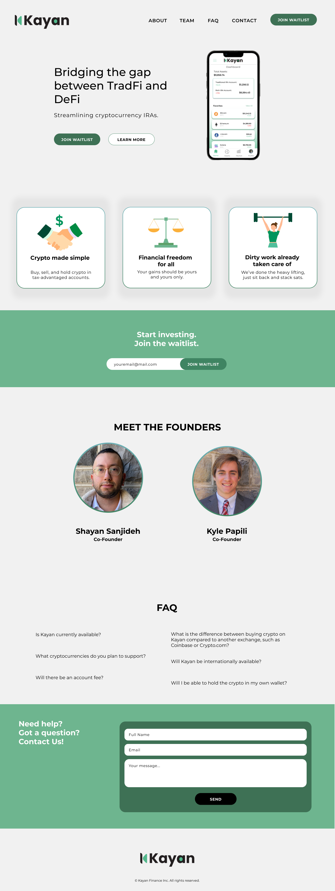
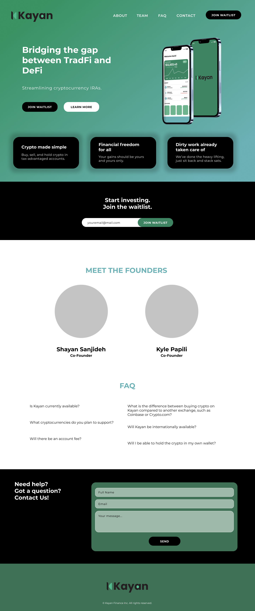

# Kayan Finance

**Role:** Frontend Developer Intern  
**Duration:** Spring Semester 2022

## Project Overview

During my internship at Kayan Finance, I had the opportunity to contribute as a Frontend Developer. My responsibilities included designing the user interface for the iOS mobile application and developing the web application from scratch using HTML, CSS, and JavaScript.

Unfortunately, the startup faced challenges in securing sufficient capital and ultimately closed down. As a result, I was only able to provide the code for the website and could not publish my designs or the developed application. The wireframes for the mobile app were still in progress at the time of the closure.

You can view my progress [here](https://www.figma.com/file/g5GFbJBvmvUgYkgGnJZUF8/Kayan-Finance-Landing-Page).

### Video Demonstration

## Visual Designs
### Light Mode V1

 
  

### Light Mode V2

 
  

